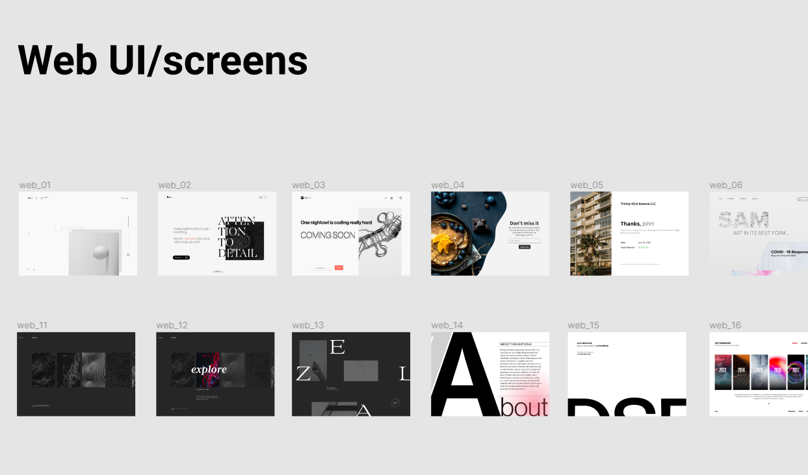

<h1 align="center">WEB UI SCREENS (18+)</h1>



# `layout`

### npm install (node package manager)
```bash
npm i
```

### Tailwind `Two` Command convenience for the compiler
```bash
npm run dev
```

```bash
npm run twind
```