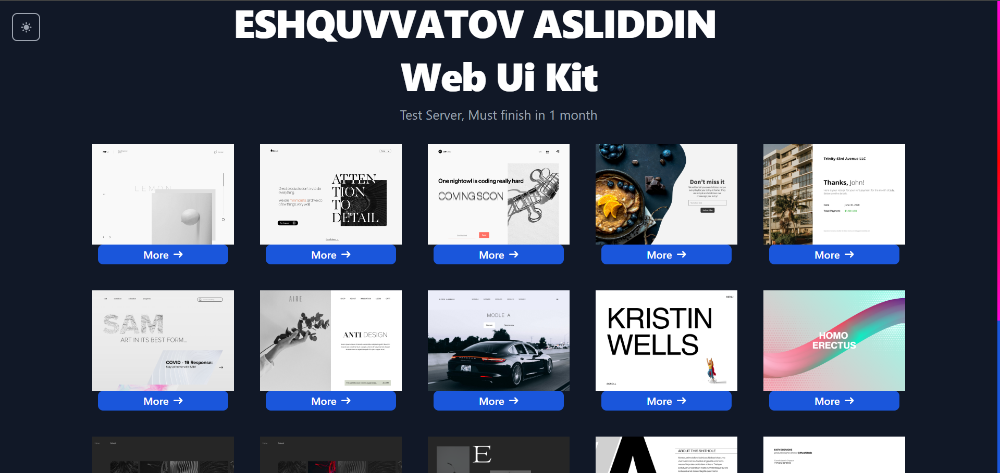
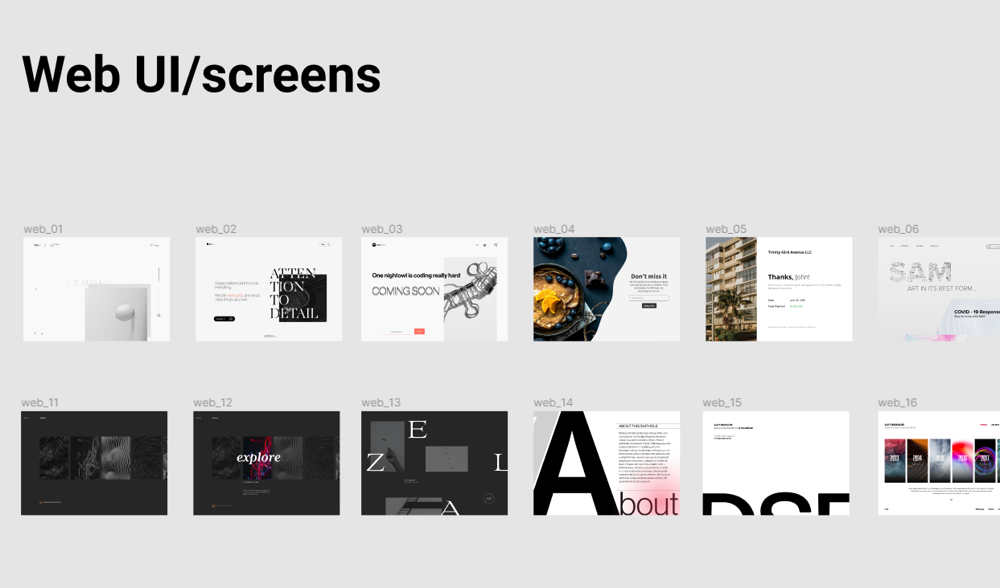

<h1 align="center">Now</h1>




<h1 align="center">WEB UI SCREENS (19)</h1>



# `layout`

### npm install (node package manager)
```bash
npm i
```

### Tailwind `Two` Command convenience for the compiler
```bash
npm run dev
```

```bash
npm run twind
```